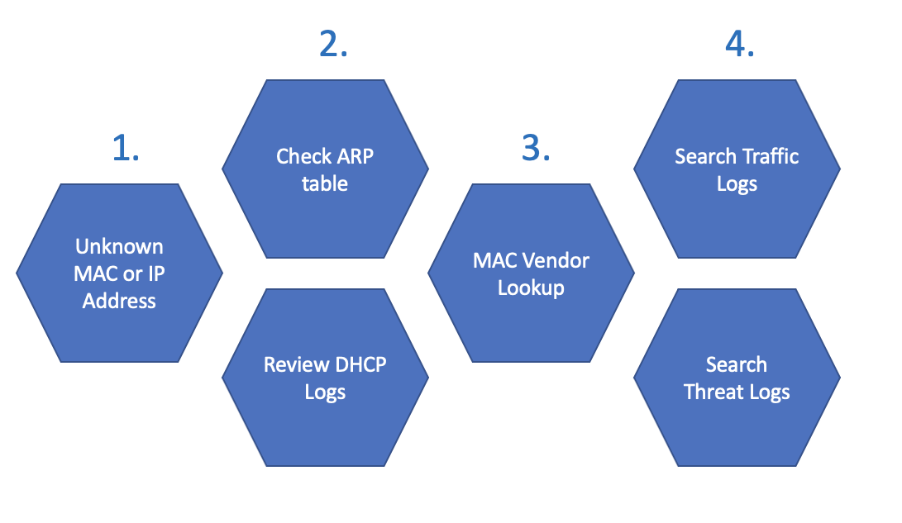

## Workflow

[Getting your API](https://docs.paloaltonetworks.com/pan-os/9-1/pan-os-panorama-api/get-started-with-the-pan-os-xml-api/get-your-api-key)

To Start working with the Palo Alto API, we'll need to create an API key from an existing username and password. This action is only performed once and will only return the key once so make sure to capture the response. Treat your API key like a password.

```
curl -k -X GET 'https://10.10.10.10/api/?type=keygen&user=apiguy&password=apiguypassword' 
```

This get requests sends a username and password and returns with a an API key that we'll use for remaining requests.

```
<response status = 'success'>
    <result>
         <key>137782add6d930790707216ab8203b79d9394f05TU5JdDBFcVlsWjdSODVXZGh137782add6d930790707216ab8203b79d9394f05zYjV137782add6d930790707216ab8203b79d9394f05</key>
    </result>
</response> 
```

## EXAMPLE 1: Retrieve Firewall System Info

Grab system info from Palo using header auth

```
curl -H "X-PAN-KEY: 137782add6d930790707216ab8203b79d9394f05TU5JdDBFcVlsWjdSODVXZGh137782add6d930790707216ab8203b79d9394f05zYjV137782add6d930790707216ab8203b79d9394f05" -k 'https://10.10.10.10/api/?type=op&cmd=<show><system><info></info></system></show>' 
```

If everything is working correctly, we'll get infomation similar to the following:

```
<response status="success"><result><system>
    <hostname>Cyber-Range-Edge</hostname>
    <ip-address>...
    ...<time>Wed Jun 22 20:02:46 2022</time>
    <uptime>18 days, 20:47:04</uptime>
    <devicename>Cyber-Range-Edge</devicename>
    <family>220</family>
    <model>PA-220</model>...<truncated> 
```

## EXAMPLE 2: Backup a Running-config

[Knowledge Base Article](https://knowledgebase.paloaltonetworks.com/KCSArticleDetail?id=kA10g000000Cm7yCAC)

Pull the config using the API

```
curl -kG "https://10.10.10.10/api/?type=export&category=configuration&key=137782add6d930790707216ab8203b79d9394f05TU5JdDBFcVlsWjdSODVXZGh137782add6d930790707216ab8203b79d9394f05zYjV137782add6d930790707216ab8203b79d9394f05" 
```

This will return the running-config directly to the terminal:

```
<config version="10.1.0" urldb="paloaltonetworks" detail-version="10.1.0">
    <mgt-config>
       <users>
          ...<truncated> 
```

Let's run the same command and route the output to a file. It's recommended to include the date the backup was pulled in the filename.

```
curl -kG "https://10.10.10.10/api/?type=export&category=configuration&key=137782add6d930790707216ab8203b79d9394f05TU5JdDBFcVlsWjdSODVXZGh137782add6d930790707216ab8203b79d9394f05zYjV137782add6d930790707216ab8203b79d9394f05" > 6-6-22-running-config.xml 
```

Adding "> 6-6-22-running-config.xml" to the end of the curl request redirects standard output to the file 6-6-22-running-config.xml. If all went smoothly, this file is a working running-config backup. It should be treated with care, as it can contain certificates, keys, usernames, password hashes and other configuration details.

This Github repo has a sample Python script that will create a backup and store it using the date in the filename. This script can be run with a CRON job (or scheduled task) for recurring backups. [panback.py](https://github.com/nopnoplabs/cr-netbackup/blob/main/panback.py)

## EXAMPLE 3: INVESTIGATE AN ASSET (unknown device)




### Review Workflow

Reviewing logs and alerts, you may encounter a device that you do not recognize. This workflow can help us passively learn more about the device without disrupting, blocking or attempting to connect to it.

1.  Starting with either a suspicious MAC address or a suspicious IP address, we'll want to find the remaining variable. MAC addresses will be most helpful with devices that are Layer 2 adjacent (not connected through another router). 

2.  We can use API queries to search the DHCP entries in the system log and look at the active ARP table to map IP and MAC addresses from the firewalls perspective.

3.  Who makes this device? We can use an API to query a public directory of MAC addresses and with the MAC address and see what type of device it's registered as.

4. We can look at traffic logs  and threat logs and examine host behaviors

### Important Notes

* Some API queries will provide immediate results (looking at the ARP table). More complex queries will return a job ID, and the results will be retrieved with a second query referencing that job ID.

* Traffic and threat queries will return a maximum 20 results by default.

### Step 2: Check ARP Entries and DHCP Logs

This command will return with the ARP table in XML format:

`https://<firewallip>/api/?type=op&cmd=%3Cshow%3E%3Carp%3E%3Centry+name+%3D+%27all%27%2F%3E%3C%2Farp%3E%3C%2Fshow>`

This query will search the system logs for (subtype eq DHCP). This query will return a Job ID - we can view the results by retrieving the Job ID.

`https://<firewallip>/api/?type=log&log-type=system&query=(%20subtype%20eq%20dhcp%20)`

To view the Job ID:

`https://<firewallip>/api/?type=log&action=get&job-id=82`

### Step 3: Check ARP Entries and DHCP Logs

MAC vendor lookup

`curl https://api.macvendors.com/FC-A1-3E-2A-1C-33`

### Step 4: Search Traffic Logs and Threat Logs

[https://docs.paloaltonetworks.com/pan-os/10-1/pan-os-panorama-api/pan-os-xml-api-request-types/retrieve-logs-api](https://docs.paloaltonetworks.com/pan-os/10-1/pan-os-panorama-api/pan-os-xml-api-request-types/retrieve-logs-api)

#### TRAFFIC LOGS

**Where is traffic going?**

A default query will respond with a maximum of 20 entries. Unless a date range is specified, it will respond with the latest results. These behaviors can be changed with parameters like nlog and dir. You can learn about available parameters to send the XML API on your firewall at:

`https://<firewallip>/php/rest/browse.php/log::traffic`

A basic traffic query would look like this:

`https://10.10.10.10/api/?type=log&log-type=traffic&query=(%20addr.src%20in%2010.222.2.103%20)`

This will execute a search on the firewall and return a job number. A second query requeseting that job number will return the results in XML (replace 158 with the appropriate job number).

**Search Results**

`https://10.10.10.10/api/?type=log&action=get&job-id=158`

**How would you search the logs and learn the following?**

When was the device first seen?

When was the device last seen?

Destination address?

Destination region?

Application (or ports/protocol)?


#### THREAT LOGS

**Any threat events triggered?**

This will execute a search in the threat logs for the same IP address as our traffic log search. Just like the traffic log search, the firewall will return a job ID. A second query with that job ID will return XML search results.

`https://10.10.10.10/api/?type=log&log-type=threat&query=(%20addr.src%20in%2010.222.2.103%20)`

**Search Results**

`https://10.10.10.10/api/?type=log&action=get&job-id=158`

## Bonus

Search XML logs with Xpath queries.

Log search results can be downloaded and saved as local XML files. You can open them with any text editor, or search them using XPath:

[https://www.w3schools.com/xml/xml_xpath.asp](https://www.w3schools.com/xml/xml_xpath.asp)

Review [xml.py](XML/xml.py)